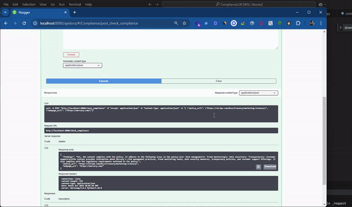

### LM Studio Compliance Checker

This project provides a Flask-based API to check webpage content against a compliance policy using a large language model (LLM). The API compares the content of a webpage with a policy and generates a compliance report.

## Demo
Here's a GIF demonstrating how the app works:



#### Table of Contents
- [Demo](#demo)
    - [Table of Contents](#table-of-contents)
  - [Features](#features)
  - [Requirements](#requirements)
  - [Installation](#installation)
  - [Configuration](#configuration)
  - [Running the Application](#running-the-application)
  - [API Endpoint](#api-endpoint)
    - [Request](#request)
    - [Response](#response)
  - [Usage Example](#usage-example)
  - [Local LLM Setup (LM Studio)](#local-llm-setup-lm-studio)
    - [Steps to Set Up LM Studio:](#steps-to-set-up-lm-studio)
  - [Directory Structure](#directory-structure)

---

### Features
- Extracts content from policy and webpage URLs.
- Performs a compliance check using a local LLM (`gemma-2b-it-GGUF`).
- Saves compliance results to files.
- Simple API interface to interact with the service.

### Requirements
- Python 3.10+
- LM Studio (for running local LLM models)
- Flask
- Requests
- BeautifulSoup
- OpenAI
- Flasgger (for Swagger UI)

### Installation

1. Clone the repository:
    ```bash
    git clone https://github.com/your-repo/compliance-checker-api.git
    cd compliance-checker-api
    ```

2. Create and activate a virtual environment:
    ```bash
    python3 -m venv venv
    source venv/bin/activate
    ```

3. Install required Python dependencies:
    ```bash
    pip install -r requirements.txt
    ```

4. Install [LM Studio](#local-llm-setup-lm-studio) and download the `gemma-2b-it-GGUF` model.

### Configuration

- The project is configured to use **LM Studio** as a local server for the LLM.
- Modify the following constants in `app.py` to match your configuration:

    ```python
    LLM_MODEL = 'lmstudio-ai/gemma-2b-it-GGUF' # model name
    BASE_URL = "https://localhost:1234/v1" # Replace with your model base_url
    API_KEY = "lm-studio"  # Replace with your API key if necessary
    ```

### Running the Application

1. Make sure LM Studio is running locally and the model `gemma-2b-it-GGUF` is loaded.
2. Start the Flask application:
    ```bash
    python app.py
    ```
3. Access the API documentation via Swagger at:
    ```
    http://127.0.0.1:8080/apidocs/
    ```

### API Endpoint

**POST** `/check_compliance`

#### Request
- **Body (JSON)**:
    - `policy_url`: URL of the compliance policy.
    - `webpage_url`: URL of the webpage to check.

Example:
```json
{
  "policy_url": "https://stripe.com/docs/treasury/marketing-treasury",
  "webpage_url": "https://mercury.com/"
}
```

#### Response
- **200 OK**:
    - `policy_url`: URL of the policy.
    - `webpage_url`: URL of the webpage.
    - `findings`: Compliance report generated by the LLM.

Example:
```json
{
  "policy_url": "https://stripe.com/docs/treasury/marketing-treasury",
  "webpage_url": "https://mercury.com/",
  "findings": "The content of the webpage complies with the policy, specifically sections 2 and 3."
}
```

### Usage Example

1. Use an API client like Postman or CURL:
    ```bash
    curl -X POST http://127.0.0.1:8080/check_compliance \
    -H "Content-Type: application/json" \
    -d '{"policy_url": "https://stripe.com/docs/treasury/marketing-treasury", "webpage_url": "https://mercury.com/"}'
    ```

2. View the result in your terminal or through the API response.

### Local LLM Setup (LM Studio)

This project uses **LM Studio** for running the `gemma-2b-it-GGUF` model locally. 

#### Steps to Set Up LM Studio:

1. **Download and Install LM Studio**:
    - [Download LM Studio](https://lmstudio.ai/) from the official website and install it on your machine.

2. **Download the Model**:
    - Download the model `gemma-2b-it-GGUF` from LM Studio's model hub or another trusted source.

3. **Run LM Studio**:
    - Start LM Studio and load the `gemma-2b-it-GGUF` model.
    - Endpoint `localhost:1234`

### Directory Structure

```
/your_project
│
├── /docs                     # For saving policies, webpages, and results
│   ├── /policy
│   ├── /website
│   └── /result
│
├── /src                      # Contains modular Python scripts
│   ├── __init__.py
│   ├── llm_client.py          # LLM interaction logic
│   ├── file_manager.py        # File saving and management logic
│   ├── compliance_checker.py  # Compliance checking logic
│
├── app.py                    # Main Flask app
├── requirements.txt          # Python dependencies
└── README.md                 # Project documentation
```

License
This project is licensed under the MIT License. See the LICENSE file for more details.